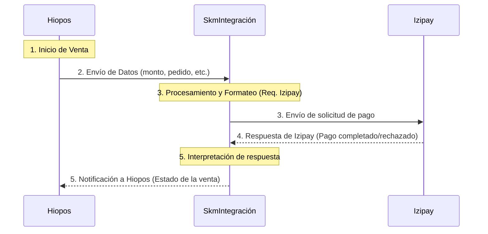

# skmintegracion

Este proyecto sirve como un middleware o puente para facilitar la comunicación entre la aplicación de punto de venta **Hiopos** y la pasarela de pagos **Izipay**. El objetivo principal es procesar transacciones de venta de manera fluida y automatizada.

## Flujo de Funcionamiento

El proceso de una transacción se realiza de la siguiente manera:

1.  **Inicio desde Hiopos**: El proceso de venta se inicia en la aplicación de Hiopos.
2.  **Envío de Datos**: Hiopos envía los datos de la transacción (monto, detalles del pedido, etc.) a este servicio de integración (`skmintegracion`).
3.  **Procesamiento y Redirección**: La aplicación procesa los datos recibidos y los formatea según los requerimientos de Izipay. Luego, envía la solicitud de pago a la pasarela de Izipay.
4.  **Respuesta de Izipay**: Una vez que el pago es completado (o rechazado) en Izipay, la pasarela envía una respuesta a este servicio.
5.  **Notificación a Hiopos**: Finalmente, `skmintegracion` recibe la respuesta de Izipay, la interpreta y la reenvía a Hiopos para actualizar el estado de la venta (aprobada, denegada, etc.).

## Diagrama del Flujo

